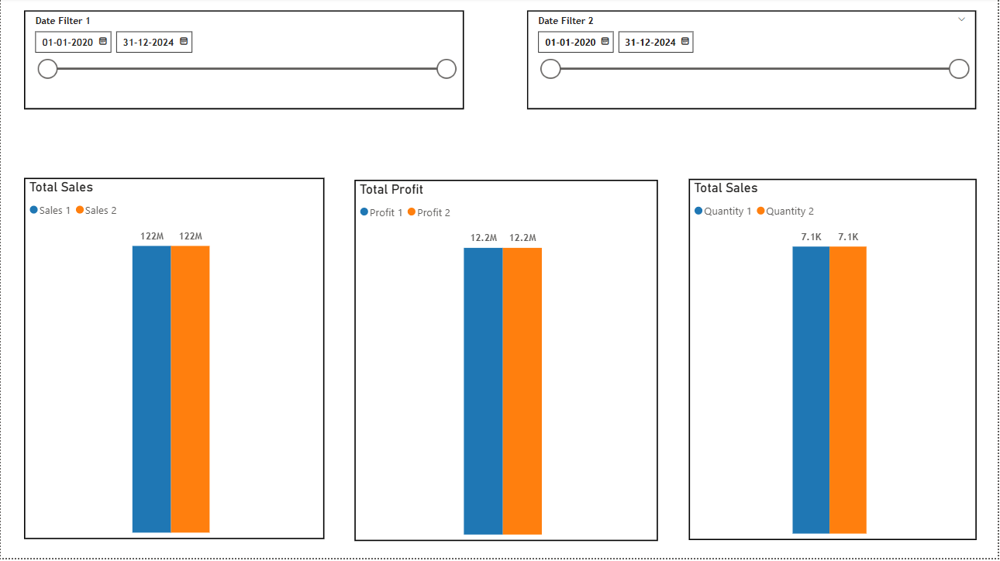
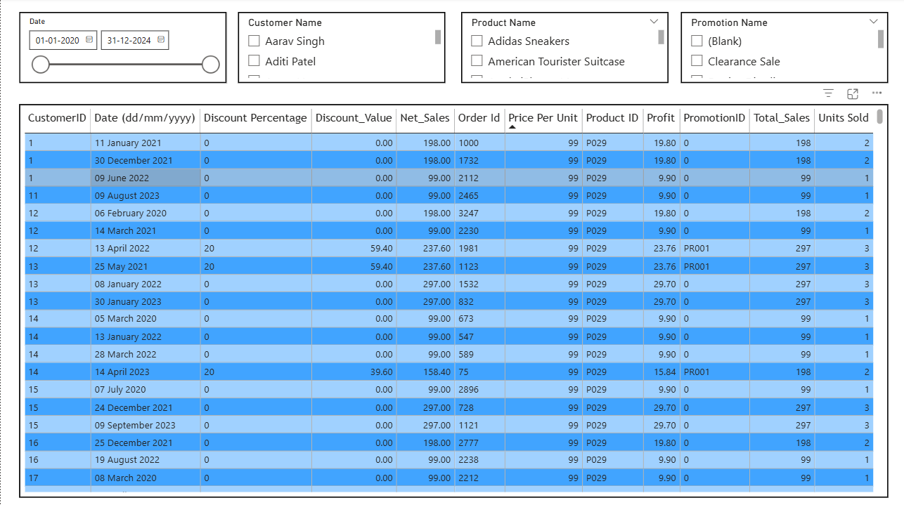
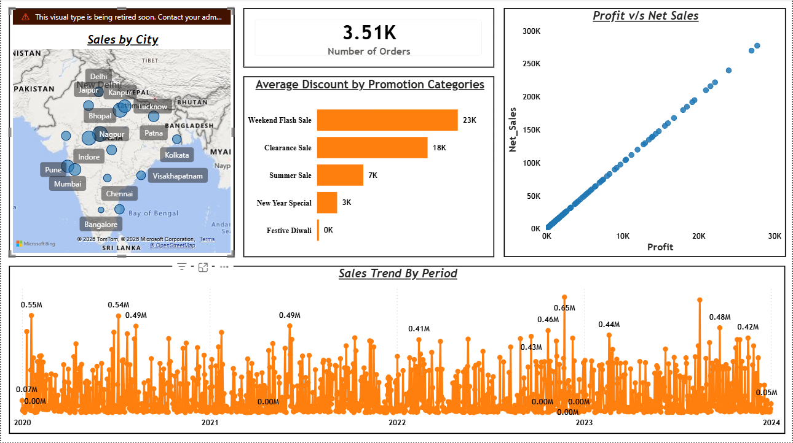
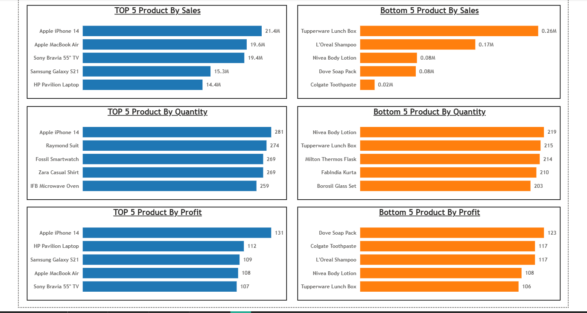

# 📊 Sales Performance Analysis Dashboard

(Power BI | Data Modeling | DAX)

📌 Project Overview

This project presents an interactive Sales Performance Dashboard built using Power BI.

It provides detailed insights into:

Sales and profit performance

Product-level analysis (Top & Bottom performers)

Customer and city-wise trends

Promotion effectiveness

Time-based sales patterns

This is a complete end-to-end data analytics project covering data transformation, modeling, DAX calculations, and visualization.

🎯 Objectives

Analyze overall sales, profit, and quantity metrics

Track sales trends over time

Identify top and bottom performing products

Evaluate the impact of discounts and promotions

Compare profit vs net sales relationships

Understand regional (city-wise) performance

Enable dynamic filtering using slicers

🏗️ Project Workflow

1️⃣ Data Loading

Imported dataset into Power BI

Verified data structure and relationships

2️⃣ Data Transformation

Cleaned and formatted data using Power Query

Handled missing and inconsistent values

Created necessary calculated columns

3️⃣ Data Modeling

Established Primary & Foreign key relationships

Built a Star Schema

Defined relationships and cardinality

4️⃣ Data Analysis

Created DAX measures for:

Total Sales

Total Profit

Quantity Sold

Discount calculations

Implemented comparative analysis using multiple date filters

5️⃣ Data Visualization

Built interactive dashboards with:

KPI cards

Bar charts

Line charts

Scatter plots

Map visualizations

Enabled slicers for dynamic filtering

📂 Dataset Description

🔹 Sales Data

Order ID

Customer ID

Product ID

Date

Net Sales

Total Sales

Units Sold

Profit

Discount Percentage & Value

🔹 Product Data

Product Name

Category

🔹 Customer Data

Customer Name

Location (City)

🔹 Promotion Data

Promotion Name

Promotion ID

🛠️ Tools & Technologies Used

Power BI – Dashboard & visualization

Power Query – Data transformation

DAX – Measures and calculations

Data Modeling – Star schema design

📊 Dashboard Features

🔹 KPI Cards

📦 Number of Orders: 3.51K

💰 Total Sales

📈 Total Profit

📊 Total Quantity Sold

🔹 Visualizations

📌 Sales Analysis

Sales comparison using dual date filters

Sales trend over time

📌 Product Analysis

Top 5 Products by Sales, Profit, and Quantity

Bottom 5 Products by Sales, Profit, and Quantity

📌 Profitability Analysis

Profit vs Net Sales (Scatter Plot)

Relationship between revenue and profitability

📌 Promotion Analysis

Average discount by promotion category

Impact of promotional campaigns

📌 Regional Analysis

Sales by City (Map Visualization)

💡 Key Insights

Certain products consistently drive the majority of revenue

Discounts increase sales but impact profit margins

Sales show fluctuations across time periods

Strong positive relationship between sales and profit

Some products contribute very low revenue and may need review

Promotional campaigns significantly influence sales performance

📸 Dashboard Preview

🚀 How to Use

🔹 Power BI

Open the .pbix file

Refresh data if needed

Use slicers (Date, Customer, Product, Promotion)

Interact with visuals to explore insights

⭐ What Makes This Project Stand Out

End-to-end Power BI workflow

Advanced DAX calculations

Star schema data modeling

Interactive and user-friendly dashboard

Business-focused insights
